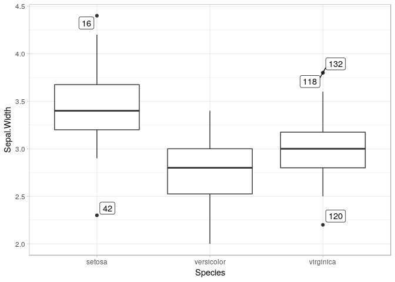

Boxplot with labelled outliers
================

Load libraries
--------------

``` r
library(dplyr)
library(ggplot2)
library(ggrepel)
```

Subset data
-----------

``` r
iqr_constant <- 1.5 # see ?geom_boxplot
iris_subset <- iris %>% 
  group_by(Species) %>% 
  mutate(q1=quantile(Sepal.Width, 0.25), q3=quantile(Sepal.Width, 0.75)) %>% 
  mutate(inter_quartile_range=q3 - q1) %>%
  mutate(
    upper_threshold= q3 + iqr_constant * inter_quartile_range, 
    lower_threshold= q1 - iqr_constant * inter_quartile_range
  ) %>% 
  filter(Sepal.Width > upper_threshold | Sepal.Width < lower_threshold)
```

Plot it
-------

``` r
ggplot(iris, aes(x=Species, y=Sepal.Width)) + 
    geom_boxplot() + 
    geom_label_repel(
      data=iris_subset, 
      aes(x=Species, y=Sepal.Width), 
      label=rownames(iris_subset), 
      inherit.aes=F
    ) + 
    theme_light()
```


